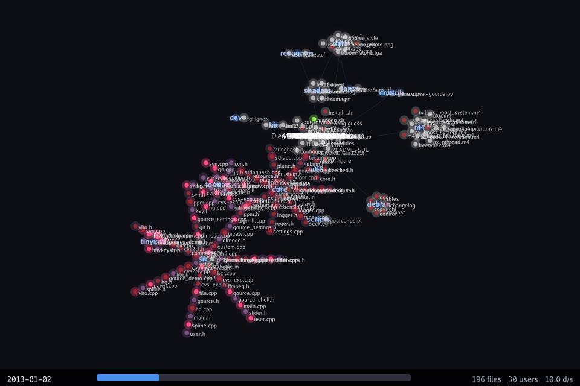

# gource-tui

A terminal-based source control visualization tool inspired by [Gource](https://gource.io). Renders git repository history as an animated force-directed graph with bloom effects, using [sixel graphics](https://en.wikipedia.org/wiki/Sixel) directly in your terminal.



## Features

- **Sixel pixel graphics** — full-color rendered frames, not character approximations
- **Force-directed graph layout** — directories and files arranged with spring physics and N-body repulsion
- **Bloom post-processing** — gaussian blur on bright areas with additive blending for glow effects
- **Bezier curve edges** — smooth quadratic curves between directories with activity-based glow
- **File heat visualization** — recently modified files glow bright, fade over time
- **Contributor entities** — colored circles with names that move between files via spring animation
- **Action beams** — lines from users to files during commits, fading as the action completes
- **Particle effects** — green sparkles on file creation, red bursts on deletion
- **Commit message captions** — floating text near users showing commit subjects
- **Auto-fit camera** — graph automatically scales to fit the terminal
- **Manual camera** — zoom (z/x/scroll), pan (arrows), reset (Home)
- **Minimap** — overview in corner when zoomed in, showing viewport position
- **Color themes** — dark, light, solarized, monokai
- **Click-to-seek** — click on the progress bar to jump to any point in history
- **Keyboard seek** — `[`/`]` to jump back/forward 5%
- **Screenshot export** — press `s` to save the current frame as PNG
- **File extension legend** — toggle with `l`, showing counts by type
- **Auto-skip** — jumps over idle periods in the history
- **Regex filters** — filter by username or file path
- **Loop mode** — restart playback when finished

## Requirements

- **Go 1.24+**
- **Sixel-capable terminal:**
  - [Windows Terminal](https://github.com/microsoft/terminal) 1.22+ (Preview)
  - [WezTerm](https://wezfurlong.org/wezterm/)
  - [foot](https://codeberg.org/dnkl/foot)
  - [mlterm](http://mlterm.sourceforge.net/)
  - xterm (with `--enable-sixel-graphics`)
- **git** on PATH (for parsing repository history)

## Install

Build from source:

```sh
git clone <repo-url>
cd gource-tui
go build -o gource-tui .
```

## Usage

```sh
# Visualize the current directory
gource-tui

# Visualize a specific repository
gource-tui /path/to/repo

# Visualize a Gource custom log file
gource-tui /path/to/custom.log

# Fast playback with solarized theme
gource-tui --speed 2.0 --theme solarized .

# Filter to a specific user
gource-tui --user-filter "Alice" .

# Only show source files, no bloom for performance
gource-tui --file-filter "\.(go|rs|py|js)$" --no-bloom .

# Date range
gource-tui --start-date 2024-01-01 --stop-date 2024-06-30 .
```

## Controls

| Key | Action |
|-|-|
| `Space` | Pause / resume |
| `+` / `-` | Speed up / slow down |
| `[` / `]` | Seek back / forward 5% |
| `z` / `x` | Zoom in / out |
| `Scroll` | Zoom in / out |
| `Drag` | Pan camera |
| `Arrows` | Pan camera |
| `Home` | Reset camera to auto-fit |
| `Click bar` | Seek to position in timeline |
| `s` | Save screenshot as PNG |
| `l` | Toggle file extension legend |
| `?` | Toggle help overlay |
| `q` | Quit |

## CLI Flags

```
Flags:
  -s, --speed float          Days of history per second of playback (default 0.5)
      --auto-skip float      Auto-skip idle periods longer than N days (default 3)
      --file-idle-time float Seconds before idle files fade (default 60)
      --user-idle-time float Seconds before idle users disappear (default 10)
      --loop                 Loop playback when finished
      --no-bloom             Disable bloom post-processing (faster)
      --theme string         Color theme: dark, light, solarized, monokai (default "dark")
      --background string    Background color as hex (e.g. #1a1a2e)
      --start-date string    Start date (YYYY-MM-DD)
      --stop-date string     Stop date (YYYY-MM-DD)
      --user-filter string   Regex to filter users (only show matching)
      --file-filter string   Regex to filter file paths
      --hide-filenames       Hide file name labels
      --hide-dirnames        Hide directory name labels
      --hide-usernames       Hide user name labels
      --hide-date            Hide the date overlay
      --hide-progress        Hide the progress bar
      --cell-size string     Override cell pixel size as WxH (e.g. 8x18)
      --debug                Show FPS counter and debug info
```

## Custom Log Format

gource-tui can read [Gource's custom log format](https://github.com/acaudwell/Gource/wiki/Custom-Log-Format):

```
timestamp|username|A/M/D|filepath|color
```

Generate one from an existing repository with Gource:

```sh
gource --output-custom-log project.log /path/to/repo
gource-tui project.log
```

## Troubleshooting

### Image wraps / renders twice

Your terminal's cell pixel size doesn't match the default (8x18). Use `--cell-size` to set the correct value:

```sh
# Try common sizes
gource-tui --cell-size 8x20 .
gource-tui --cell-size 9x18 .
gource-tui --cell-size 10x22 .
```

To find your terminal's cell size, resize to a known dimension and divide the window pixel size by the cell count.

### No image appears

Your terminal may not support sixel graphics. Check the [requirements](#requirements) for supported terminals.

### Low FPS

- Use `--no-bloom` to disable the bloom post-process (biggest performance impact)
- Reduce terminal size (fewer pixels to render)
- Use `--hide-filenames --hide-usernames` to skip text rendering

## Architecture

```
gource-tui/
  main.go              CLI entry point (cobra)
  config/
    settings.go        Configuration struct
    colors.go          File extension and user color palettes
    theme.go           Color themes (dark, light, solarized, monokai)
  parser/
    parser.go          Parser interface and auto-detection
    git.go             Git log parser (streaming via goroutine)
    custom.go          Gource custom format parser
    commit.go          Commit data types
  model/
    app.go             Bubble Tea model (Init/Update/View)
    tree.go            Directory tree with insert/remove/physics
    file.go            File entity (heat, lifecycle, color)
    user.go            User entity (spring movement, idle tracking)
    action.go          User-to-file action with progress
    playback.go        Time cursor, commit queue, seeking
    layout.go          Force-directed layout engine
    particle.go        Particle system (create/delete effects)
    caption.go         Floating commit message captions
    view.go            Sixel output and cell size detection
    render.go          Pixel rendering (gg canvas, bloom, overlays)
```

## Built With

- [Bubble Tea](https://github.com/charmbracelet/bubbletea) — terminal UI framework (Elm architecture)
- [Lip Gloss](https://github.com/charmbracelet/lipgloss) — terminal styling
- [Harmonica](https://github.com/charmbracelet/harmonica) — spring physics for smooth animation
- [gg](https://github.com/fogleman/gg) — 2D graphics rendering
- [go-sixel](https://github.com/mattn/go-sixel) — sixel image encoding
- [imaging](https://github.com/disintegration/imaging) — gaussian blur for bloom effect
- [cobra](https://github.com/spf13/cobra) — CLI framework

## Credits

Inspired by [Gource](https://gource.io) by [Andrew Caudwell](https://github.com/acaudwell).

## License

[GPLv3](COPYING)
